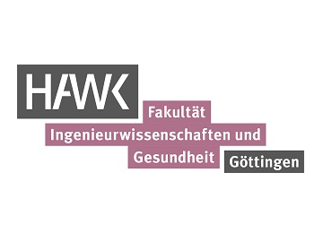

 <font-size: 24px;"><strong>Unitree A1</strong>

  
[MYROBOTSHOP](https://www.docs.quadruped.de/projects/a1/html/quick_start.html#robot-setup)

[rbd_packages](https://www.zhaw.ch/storage/engineering/institute-zentren/cai/studentische_arbeiten/Spring_2023/Spring23_BA_PfammatterSchweizer.pdf)

[Gait Planning](https://www.mybotshop.de/QUADRUPED-Gait-Planning)

#### Connecting to the internet

- Connect the A1 via ethernet to the internet
- Open a terminal on A1 and type **sudo gedit /etc/network/interfaces** and comment everything out.
- Save the file and in the terminal type **sudo systemctl restart NetworkManager.service**
- On the top right of the desktop change the network to **Wired connection**
- Now the internet should be working.
- In order to restore the connection between all the components again, undo the changes to the **interfaces** file and restart the network manager again.
- Sometimes a reboot is necessary.

#### Using the librealsense sdk:

- Type **realsense-viewer** into the terminal to access the realsense viewer program. Here you can view all the different possible camera streams from the d435i as well as 3d pointcloud stream.
- You can also upgrade the camera firmware through this software, but it is currently set to the correct firmware for the librealsense SDK and ROS-Wrapper version installed on the A1.
- The **Realsense SDK** also includes some examples which are already compiled in the **/home/unitree/librealsense/build/examples** folder
- To run them, just type the name of the file in the terminal, for example **rs-capture** which launches a window with a colour, depth, gyro and accelerometer stream
- Each example also has a readme file containing a code break down found in **/home/unitree/librealsense/examples**
  
#### Using the realsense ros-wrapper

- The ros-wrapper is located in **/home/unitree/catkin_ws/src/realsense/realsense2_camera** and also contains many example roslaunch files.
- Type **roslaunch realsense2_camera rs_capture** into the terminal to stream all camera sensors and publish on the appropriate ROS topics.
- These streams can then be visualised through Rviz.
- Refer to the realsense2_camera readme for a detailed guide on the usage of the ROS Wrapper.

#### Using the Unitree_legged_sdk

- The Unitree_legged_sdk contains some examples for High and Low level movements

#### Using the RobotSLAMSystem

-

#### Using the Gesture Recognition demo

- First, open the readme file and install all the required dependencies. The readme also contains a detailed explaination of how the program functions and how you can train the model to recognize new hand gestures
- Next, connect to the A1 with your remote pc via ethernet or the A1 wifi hotspot.
- Then open a terminal, navigate to the folder containing the app.py file and type **python3 app.py**
- A window should now pop up with the video stream

#### Using the Unitree qre package from MYBOTSHOP

- The unitree_legged_sdk(utils) and the ros_to_real package(third_party) are already included in the package. Please refer to the readme for installing.
- This package requires an Ouster and ZED2 camera for full functionality. However, some of the launch files can still be used with the setup on our A1 and it is possible to get the odom data from another camera using something like [VINS_Fusion](https://github.com/HKUST-Aerial-Robotics/VINS-Fusion?tab=readme-ov-file) or the realsense ROS-wrapper.

The following will allow you to control the A1 with a keyboard.
- **sudo su**
- **source catkin_ws/devel/setup.bash**
- **roslaunch a1_hardware_driver high_level_mode.launch** This launches an LCM server that communicates with 
- **rosrun teleop_twist_keyboard teleop_twist_keyboard.py** Keyboard control

#### Using the rbd_packages

-
