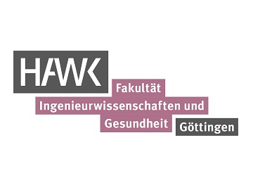

<p align="center"></p>
<p align="center"> <font-size: 32px;"><strong>Unitree A1</strong></p>
  


#### Connecting to the internet

- Connect the A1 via ethernet to the internet
- Open a terminal on A1 and type `sudo gedit /etc/network/interfaces` and comment everything out.
- Save the file and in the terminal type `sudo systemctl restart NetworkManager.service`
- On the top right of the desktop change the network to **Wired connection**
- Now the internet should be working.
- In order to restore the connection between all the components again, undo the changes to the **interfaces** file and restart the network manager again.
- Sometimes a reboot is necessary.

#### Accessing the A1 with LAN and the Hotspot

- The Nvidea TX2 IP address is `192.168.123.12`. This board handles SLAM, Image Transmission and Stereo Vision and is also where you will implement most of your code.
- The x86 Platform IP address is `192.168.123.161`. This board handles User Logic control, Sport mode controller and the unitree_sdk. When you start an LCM server using the Unitree SDK examples, it connects to this board and and sends the movement commands over UDP.
- The default password for both is **123**
- The default password for the wifi hotspot is **00000000**

####  Unitree_legged_sdk

- The Unitree_legged_sdk contains some examples for High and Low level control.
- For High level control, make sure the robot is standing and for Low level control the robot must be hung from a strap.
- These examples communicate with the A1 over UDP and can be run with the relevant command, such as `sudo ./example_walk`
- However, when I ran these examples, the A1 went through the movements briefly and then fell to the ground. I suspect it is either due to the acctuators not receiving enough power (I was using a powersupply to power the A1) or there is a certain amount of latency which leads to the movements becoming out of sync which causes the A1 to go into safe mode and instantly stop all processes.

#### RobotSLAMSystem

- The `RobotSLAMSystem` will be begin on startup if the lidar is connected to the Nvidea NX, otherwise the RobotVisionSystem will start.
- Both the RobotSLAMSystem and the RobotVisionSystem cannot be run at the same time. Attempting this will result in an **Bind client ip&port failed** error for whichever process starts secondly. Thus, you must first `kill PID # replace PID with RobotVisionSyst PID` if RobotVisionSystem is running.
- To start the RobotSLAMSystem, navigate to the RobotSLAMSystem folder in the terminal and type `./start.sh`. This currently starts all the relevant nodes and topics for slam and opens a rviz window.
- You can set a goal using the 2d Nav Goal button or directly sending to a command to **/move_base_simple/goal**
- However, unitl now I have been unable to get it to navigate although data is being published to the **/base_controller_node** from **/cmd_vel**. I suspect it is due to the powersupply being unable to supply enough power. Test this with the battery.

#### RobotVisionSystem

- This uses the MJPG streamer to stream video through http to the unitree mobile app. You can access this stream through the web browser by typing `192.168.123.12:8080/`
- If you want to use this stream with opencv or something similar, then use `http://192.168.123.12:8080/?action=stream`.
- With opencv for example, this would be: `cap = cv.VideoCapture('http://192.168.123.12:8080/?action=stream')`

#### qre_a1 package from [MYROBOTSHOP](https://www.docs.quadruped.de/projects/a1/html/quick_start.html#robot-setup)

- This is a private repository from MYBOTSHOP which Niklas has access to.
- The **unitree_legged_sdk**(utils) and the **ros_to_real**(third_party) packages are already included in the qre repository. Please refer to the readme for installing.
- This package requires an Ouster and ZED2 camera for full functionality, such as SLAM and autonomous navigation. However, some of the launch files can still be used with the setup on our A1 and it is possible to get the odom data required for the package from another camera using something like [VINS_Fusion](https://github.com/HKUST-Aerial-Robotics/VINS-Fusion?tab=readme-ov-file) or the [realsense ROS-wrapper](https://github.com/TomBrown123/realsense-ros/tree/ros1-legacy).

The following will allow you to control the A1's movement with a keyboard.

```bash
sudo su
source catkin_ws/devel/setup.bash
roslaunch a1_hardware_driver high_level_mode.launch # This launches an LCM server that communicates with the x86 platform
rosrun teleop_twist_keyboard teleop_twist_keyboard.py # Keyboard control
```

#### Gait Planner

- It is also possible to implement new gaits for the A1 using CHAMP, TOWR or Free Gait. MYBOTSHOP has published a short guide on this [here](https://www.mybotshop.de/QUADRUPED-Gait-Planning)
##### Here are the links to the different packages:
- [CHAMP Setup Assistant](https://github.com/chvmp/champ_setup_assistant)
- [TOWR](https://wiki.ros.org/towr)
- [Free Gait](https://github.com/leggedrobotics/free_gait)

#### librealsense SDK:

- This is the SDK for the D435i Camera.
- If you want to use the SDK you must kill the `RobotVisionSyst` process first.
- Type `realsense-viewer` into the terminal to access the realsense viewer program. Here you can view all the different possible camera streams from the d435i as well as a 3d pointcloud stream.
- You can also upgrade the camera firmware through this software, but it is currently set to the correct firmware for the **librealsense** SDK and **ROS-Wrapper** version installed on the A1.
- The **Realsense SDK** also includes some examples which are already compiled in the **/home/unitree/librealsense/build/examples** folder
- To run them, just type the name of the file in the terminal, for example `rs-capture` which launches a window with a colour, depth, gyro and accelerometer stream
- Each example also has a [readme](https://github.com/TomBrown123/librealsense/tree/master/examples) file containing a code break down found in **/home/unitree/librealsense/examples**
  
#### Realsense ROS-wrapper

- The ros-wrapper is located in **/home/unitree/catkin_ws/src/realsense/realsense2_camera** and also contains many example roslaunch files.
- Type `roslaunch realsense2_camera rs_capture` into the terminal to stream all camera sensors and publish them on the appropriate ROS topics.
- These streams can then be visualised through Rviz.
- Refer to the realsense2_camera [readme](https://github.com/TomBrown123/realsense-ros/tree/ros1-legacy) for a detailed guide on the usage of the ROS Wrapper.

#### The Gesture Recognition demo

- First, open the readme file and install all the required dependencies. The [readme](https://github.com/TomBrown123/hand-gesture-recognition-mediapipe) also contains a detailed explaination of how the program functions and how you can train the model to recognize new hand gestures
- Next, connect to the A1 with your remote pc via ethernet or the A1 wifi hotspot.
- Then open a terminal, navigate to the folder containing the app.py file and type `python3 app.py`
- A window should now pop up with the video stream which recognizes some hand gestures.

#### rbd_packages

- This package was also built using an Ouster and ZED2, and as such needs to first be modified in order to work. Unfortunately there is a header file that they placed in their **qre_a1** package which is not included on their github. The **rbd_ros** package, which is supposed to used on the robot, cannot be built with catkin_make as long as it is missing.
- However, along with the [Bachelor thesis](https://www.zhaw.ch/storage/engineering/institute-zentren/cai/studentische_arbeiten/Spring_2023/Spring23_BA_PfammatterSchweizer.pdf) describing how it was designed, it provides a good start for implementing gesture recognition based movements on the A1 if one decided to build it from scratch.
